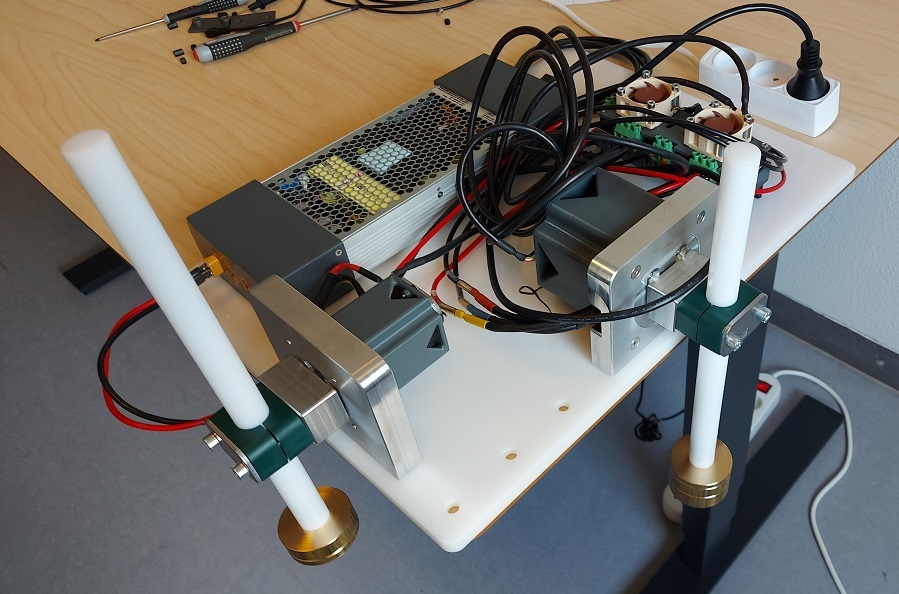

# Aarhus University Robotics Platform (AURP) Overview

## System
The system comprises:
- ODrive [D6374](https://eu.odriverobotics.com/shop/odrive-custom-motor-d6374-150kv) 150 KV BLDC motor
  - CUI [AMT102-V](https://www.cuidevices.com/product/resource/amt10.pdf) encoder - 8192 CPR quadrature with a single index mark
- ODrive [D5065](https://eu.odriverobotics.com/shop/odrive-custom-motor-d5065) 270 KV BLDC motor
  - CUI [AMT102-V](https://www.cuidevices.com/product/resource/amt10.pdf) encoder - 8192 CPR quadrature with a single index mark
- ODrive [V3.6 control board](https://eu.odriverobotics.com/shop/odrive-v36) - 56 V with connectors
  - 50 W power resistor (measured resistance of 2 &Omega;)
  - 2x Noctua [NF-A4x20 5V PWM](https://noctua.at/en/products/fan/nf-a4x20-5v-pwm) fan
- Mean Well [UHP-1000-48](https://www.meanwell.com/webapp/product/search.aspx?prod=UHP-1000) 1000 W / 48 V DC (21 A) power supply configured with 3x XT-60 connectors

<p align="center">
  
</p>


## USB driver permissions

```
echo 'SUBSYSTEM=="usb", ATTR{idVendor}=="1209", ATTR{idProduct}=="0d[0-9][0-9]", MODE="0666"' | sudo tee /etc/udev/rules.d/50-odrive.rules
sudo udevadm trigger
```

Then reconnect the odrive usb cable

